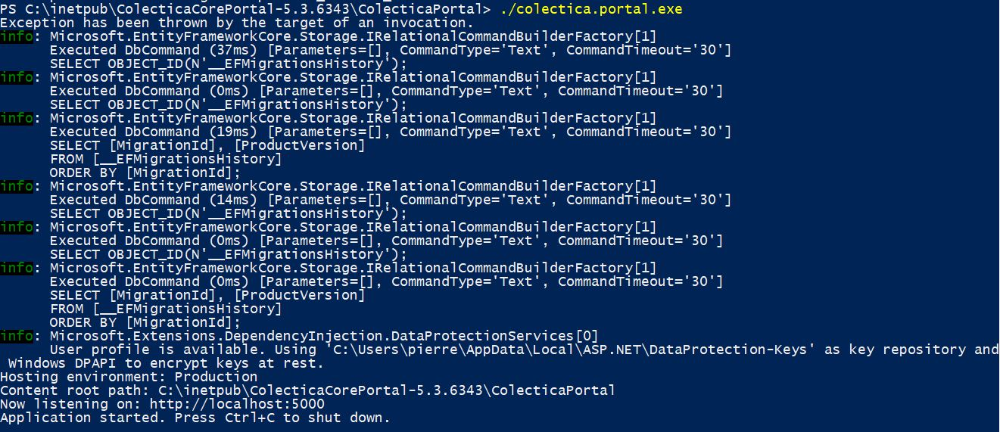
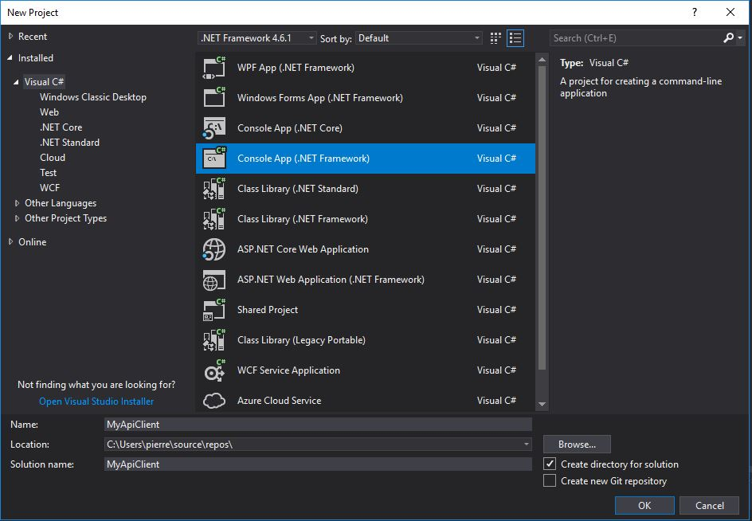
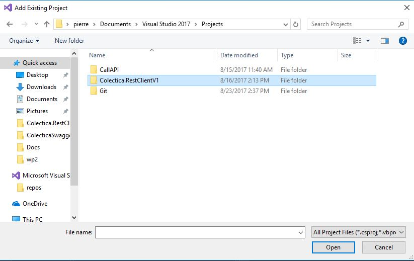
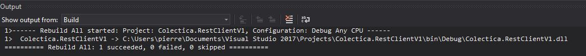

# Colectica Swagger Examples
| Java       | CSharp          | 
| ------------- |:-------------:| 
| [](https://api.travis-ci.org/pierreDebuisson/ColecticaSwaggerExamples)      | | 


__NOTE__ : Colectica Portal with Swagger API enabled are required to use these examples.
## How to generate the Swagger API
- Download the JDK 7 or higher
[here](http://www.oracle.com/technetwork/java/javase/downloads/index.html)
- Download Maven
[here](http://maven.apache.org/download.cgi)
- locate the swagger.json file
- locate your Colectica Portal directory
- execute the following commands

### Start the server
#### With command prompt
```bash
cd ColecticaPortal;
colectica.portal.exe
```
#### With bash Terminal
```bash
cd ColecticaPortal;
./colectica.portal.exe
```
 

### Generate the source code of the client library
#### Clone the Swagger-codegen source code
```bash
git clone https://github.com/swagger-api/swagger-codegen;
```

```bash
cd swagger-codegen;
mvn clean package;
java -jar swagger-codegen-cli.jar generate -i http://localhost:5000/swagger/v1/swagger.json -l java -o c:\YourTargetJavaFolder;
java -jar swagger-codegen-cli.jar generate -i http://localhost:5000/swagger/v1/swagger.json -l csharp -o c:\YourTargetCSharpFolder
```

#### Or download from maven [here](https://mvnrepository.com/artifact/io.swagger/swagger-codegen-cli) and run : 
```bash
java -jar swagger-codegen-cli.jar generate -i http://localhost:5000/swagger/v1/swagger.json -l java -o c:\YourTargetJavaFolder;
java -jar swagger-codegen-cli.jar generate -i http://localhost:5000/swagger/v1/swagger.json -l csharp -o c:\YourTargetCSharpFolder
```

### Build the client library
#### CSharp
* Open Visual Studio
* Create a new project .NetFramework library

* Add the folder **Colectica.RestClientV1** to the folder of the new project

* Build the .dll file


#### Java
* Open your favorite Java IDE
* Import the **Java/swagger** Folder in your project
* Export your project as a .jar file

### Use the client library
#### CSharp
* Add the reference of the dll to your client project via project --> Add ---> reference

#### Java
* Add the dependencies to your Java Build Path (i.e .jar) + swagger.jar (library previously built)
